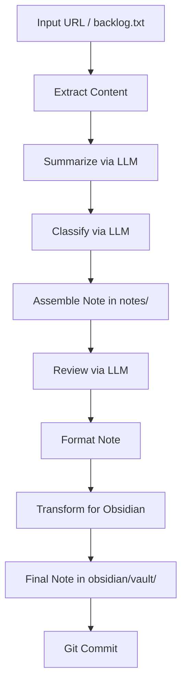

# My Second Brain powered by AI

This project is a fully automated "Second Brain" (Personal Knowledge Management) system driven by AI agents.

## Requirements

*   **AI Agent**: This system uses the [Agent Skills](https://agentskills.io) open format. It is compatible with any agent that supports this standard, including [Claude Code](https://claude.ai/code), [Gemini CLI](https://geminicli.com), [Cursor](https://cursor.com), and others.
*   **External Tools**: The following tools must be installed on your system:
    *   **Python**: Version 3.10 or higher is required to run the skills' scripts. Download from [python.org](https://www.python.org/downloads/) or install via package manager.
    *   **Git**: Required for version control and committing changes. Download from [git-scm.com](https://git-scm.com/downloads) or install via package manager (e.g., `winget install Git.Git` on Windows).
*   **LLM Configuration**: Configure your LLM provider via environment variables in `.env`:
    *   `LLM_PROVIDER`: Provider to use (`gemini` or `anthropic`). Default: `gemini`.
    *   `LLM_MODEL`: Model identifier. Default depends on provider.
    *   `LLM_API_KEY`: API key for the chosen provider.
*   **User Profile**: You must initialize your profile by running the `/setup` command before anything else. This information is stored in `.profile.md` at the project root and is used by the agent to personalize reviews and content processing.

## Objective

The goal of this project is to automatically collect, process, summarize, and organize information from various sources (web articles, YouTube videos, etc.) to create a structured and actionable knowledge base in [Obsidian](https://obsidian.md).

https://github.com/user-attachments/assets/670f1552-54b8-41e2-bb0f-be584bf72fa9

## Usage

To start adding content to your Second Brain, simply interact with your AI agent:

*   **Setup Command**: Run `/setup` before starting anything else. This command will:
    *   Verify that all required external tools (python, git) are installed.
    *   Install all required Python dependencies for the skills' scripts.
    *   Set up your user profile through a series of questions.
*   **Process Command**: Use `/process` followed by a URL (e.g., `/process https://example.com/article`) to immediately capture, summarize, and classify a resource.
*   **Batch Processing**: Run `/process` without arguments to process all URLs currently queued in `backlog.txt`.
*   **Reset Command**: Use `/reset` to reinitialize the project by deleting your user profile, all notes, and the Obsidian vault. This operation is irreversible and requires explicit confirmation.

## How It Works

The system relies on a collection of skills located in the `.claude/skills/` directory, following the [Agent Skills](https://agentskills.io) specification. These skills are orchestrated to transform a simple URL into a rich, connected note.

### Key Skills

*   **Process** (`process`): The main entry point. Takes a URL (or reads from `backlog.txt`), extracts content, summarizes, classifies, reviews, formats, transforms for Obsidian, and commits the note. This skill contains the full pipeline and all associated scripts.
*   **Setup** (`setup`): Initializes the user profile by asking a series of questions about professional background, interests, and preferences.
*   **Feature** (`feature`): Marks specific notes as important or "featured".
*   **Reset** (`reset`): Reinitializes the project by deleting the user profile, all notes, and the Obsidian vault.
*   **Content Standards** (`content-standards`): Enforces encoding, language, and typography rules for all generated content.
*   **Execution Standards** (`execution-standards`): Enforces cross-platform portability and safe execution conventions.

## Typical Workflow

1.  **Input**: A URL is provided to the system (via `/process` command or `backlog.txt`).
2.  **Extraction**: The content is extracted from the URL (web page or YouTube video).
3.  **Summarization**: An LLM generates a structured summary with key points and quotes.
4.  **Classification**: An LLM classifies the content by type and tags.
5.  **Assembly**: A source Markdown note is created in `notes/` (organized by type and date).
6.  **Review**: The note is enriched with a personalized review based on the user profile.
7.  **Formatting**: The note layout is standardized for consistent spacing and style.
8.  **Transformation**: The note is copied to `obsidian/vault/` with wikilinks and thumbnails.
9.  **Persistence**: The changes are committed to the Git repository.

## Directory Structure

*   `.claude/skills/`: Agent Skills definitions, scripts, and resources.
*   `notes/`: Source storage for generated notes (working format).
*   `obsidian/vault/`: Final directory intended to be opened with Obsidian (optimized generated files).
*   `backlog.txt`: Queue of URLs for batch processing.
*   `.profile.md`: User profile (generated by the `setup` skill).
*   `.env`: LLM provider configuration.

## License

This project is licensed under the Apache License 2.0 - see the [LICENSE](LICENSE) file for details.
