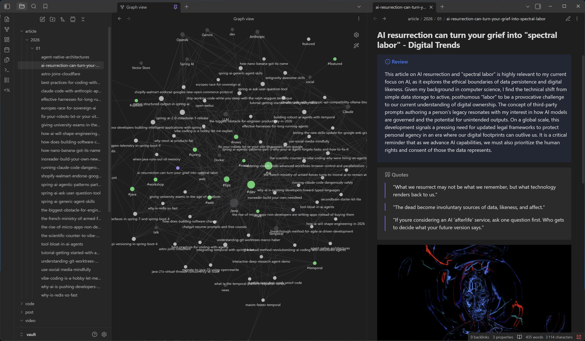
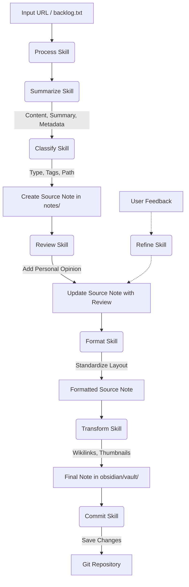

# 🧠 My Second Brain powered by AI ✨

This project is a fully automated "Second Brain" (Personal Knowledge Management) system driven by AI agents.

## Requirements

*   **Google Antigravity**: This system is specifically architected to run with [Google Antigravity](https://antigravity.google). The agent leverages the custom skills defined in `.agent/skills/` to execute complex workflows autonomously.
*   **External Tools**: The following tools must be installed on your system:
    *   **Git**: Required for version control and committing changes. Download from [git-scm.com](https://git-scm.com/downloads) or install via package manager (e.g., `winget install Git.Git` on Windows).
*   **Environment Variables**: You must define the `GEMINI_API_KEY` environment variable for the agents to function correctly. This key authorizes the underlying models used by the skills.
*   **User Profile**: You must initialize your profile by running the `/init` command before anything else. This information is stored in English in `.agent/skills/about-me/resources/profile.txt` and is used by the agent to personalize reviews and content processing.

## Objective

The goal of this project is to automatically collect, process, summarize, and organize information from various sources (web articles, YouTube videos, etc.) to create a structured and actionable knowledge base in [Obsidian](https://obsidian.md).

## Usage

To start adding content to your Second Brain, simply interact with Antigravity:

*   **Init Command**: Run the slash command `/init` before starting anything else. This command will:
    *   Verify that all required external tools (git) are installed.
    *   Install all required Python dependencies for the skills' scripts.
    *   Set up your user profile through a series of questions.
*   **Process Command**: Use the slash command `/process` followed by a URL (e.g., `/process https://example.com/article`) to immediately capture, summarize, and classify a resource.
*   **Batch Processing**: Run `/process` without arguments to process all URLs currently queued in `backlog.txt`.
*   **Reset Command**: Use the slash command `/reset` to reinitialize the project by deleting your user profile, all notes, and the Obsidian vault. This is useful when you want to start fresh. ⚠️ **Warning**: This operation is irreversible and requires explicit confirmation.

## How It Works

The system relies on a collection of "skills" located in the `.agent/skills/` directory. These skills are orchestrated to transform a simple URL into a rich, connected note.

### Key Skills

*   **Init** (`.agent/skills/init`): Initializes the user profile by asking a series of questions about professional background, interests, and preferences.
*   **Process** (`.agent/skills/process`): The main entry point. It takes a URL (or reads from `backlog.txt`), cleans the link, and orchestrates other skills to create a note.
*   **Summarize** (`.agent/skills/summarize`): Analyzes content (text or video), generates a summary, extracts key points, and retrieves metadata (duration, specific thumbnails, etc.).
*   **Classify** (`.agent/skills/classify`): Automatically determines content type (article, video, tutorial...), appropriate tags, and the destination file path.
*   **Review** (`.agent/skills/review`): Adds a personalized review to the note based on the user's professional profile.
*   **Refine** (`.agent/skills/refine`): Allows updating or improving an existing note based on specific feedback.
*   **Format** (`.agent/skills/format`): Standardizes the layout and typography of nodes for consistency.
*   **Feature** (`.agent/skills/feature`): Allows marking specific notes as important or "featured".
*   **Transform** (`.agent/skills/transform`): Prepares notes for the Obsidian vault. This includes handling internal links ("wikilinks"), formatting callouts, adding thumbnails, and setting final files to read-only to preserve generated data integrity.
*   **Commit** (`.agent/skills/commit`): Automatically saves changes to the Git repository with a standardized message.
*   **Reset** (`.agent/skills/reset`): Reinitializes the project by deleting the user profile, all notes, and the Obsidian vault. This is a destructive operation that requires explicit confirmation.

## Typical Workflow

1.  **Input**: A URL is provided to the system (via `/process` command or `backlog.txt`).
2.  **Processing**: The agent retrieves content, generates a structured summary, and classifies the resource.
3.  **Creation**: A source Markdown note is created in the `notes/` directory (organized by type and date, e.g., `notes/article/2026/01/...`).
4.  **Enrichment**: The note is enriched with a personalized review and other metadata.
5.  **Standardization**: The note layout is automatically adjusted via the **Format skill** to ensure consistent spacing and style.
6.  **Transformation**: The note is transformed and copied to `obsidian/vault/` for consumption in the Obsidian application.
7.  **Persistence**: The changes are automatically committed to the Git repository.

## Directory Structure

*   `.agent/skills/`: Python scripts and AI skill definitions.
*   `notes/`: Source storage for generated notes (working format).
*   `obsidian/vault/`: Final directory intended to be opened with Obsidian (optimized generated files).
*   `backlog.txt`: Queue of URLs for batch processing.

## License

This project is licensed under the Apache License 2.0 - see the [LICENSE](LICENSE) file for details.
